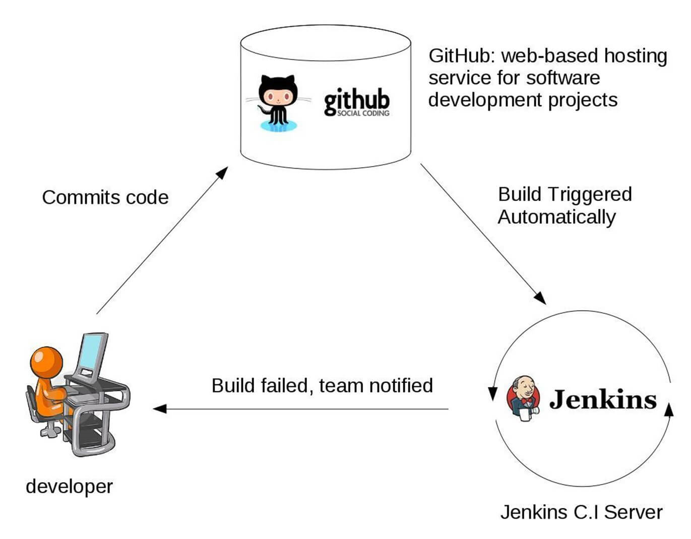

### Software Desenvolvido para Demonstração do Uso de Trabalho com Jenkins - Pipelines -

- Jenkins Ambiente Linux e Derivados.

Abaixo imagem ilustrativa do ciclo de vida da requicição:

#### Fizz Buzz Exemplo com Java 8 Usando JUnit 5

##### Fizz Buzz é um jogo em que:
- Se o número é divisível por 3, você diz Fizz
- Se o número é divisível por 5, você diz Buzz
- Se não, você diz o número

